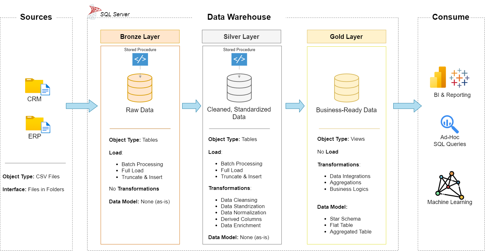

# 🏢 SQL Data Warehouse & Analytics Project
 
> An end-to-end data warehouse built on **SQL Server** using the **Medallion Architecture (Bronze → Silver → Gold)**, consolidating ERP and CRM sales data into a **star schema** and delivering SQL-based analytics on customers, products, and sales.
 


 
---
 
## 📌 Table of Contents
 
1. [Project Summary](#-project-summary)
2. [Business Problem](#-business-problem)
3. [Data Architecture](#️-data-architecture)
4. [Tech Stack](#️-tech-stack)
5. [Data Sources](#-data-sources)
6. [ETL Process (Layer by Layer)](#-etl-process-layer-by-layer)
7. [Data Quality Issues Handled](#-data-quality-issues-handled)
8. [Data Model (Gold Layer)](#-data-model-gold-layer)
9. [Analytics & Reporting](#-analytics--reporting)
10. [Repository Structure](#-repository-structure)
11. [How to Run This Project](#-how-to-run-this-project)
12. [Key Learnings & Challenges](#-key-learnings--challenges)
13. [Future Improvements](#-future-improvements)
14. [Credits & Acknowledgements](#-credits--acknowledgements)
15. [About Me](#-about-me)
---
 
## 📖 Project Summary
 
I built this project to learn how raw data from multiple source systems becomes clean, trustworthy, analysis-ready data in a real company setting. It covers the full journey:
 
- **Ingesting** raw CSV files from two source systems (CRM and ERP) into SQL Server
- **Cleaning and standardizing** the data using T-SQL
- **Integrating** both sources into a single business-friendly **star schema**
- **Writing SQL analytics** to answer real business questions
**What this project demonstrates:** SQL development, ETL pipeline design, data modeling (dimensional modeling), data quality handling, documentation, and version control.
 
---
 
## 🎯 Business Problem
 
A company stores its sales data across two disconnected systems: a **CRM** (customer, product, and sales transactions) and an **ERP** (additional customer and product attributes). The data is inconsistent, has quality issues, and cannot easily be queried together.
 
**Goal:** Build a single source of truth that lets business stakeholders and analysts answer questions like:
 
- Who are our customers, and where are they from?
- Which products and categories perform best?
- How are sales trending over time?
---
 
## 🏗️ Data Architecture
 
The warehouse follows the **Medallion Architecture** with three layers:
 

 
| Layer | Purpose | Object Type | Transformations |
|-------|---------|-------------|-----------------|
| **🥉 Bronze** | Raw, unmodified copy of source data | Tables | None (load as-is) |
| **🥈 Silver** | Cleaned, standardized, and normalized data | Tables | Cleansing, standardization, derived columns, type casting |
| **🥇 Gold** | Business-ready data for reporting | Views | Integration, business rules, star schema modeling |
 
**Why Medallion?** Separating layers makes the pipeline easier to debug (I can always trace a value back to raw data), easier to maintain, and lets each layer have a single, clear responsibility.
 
---
 
## 🛠️ Tech Stack
 
| Category | Tool |
|----------|------|
| Database | Microsoft SQL Server Express |
| Language | T-SQL (stored procedures, CTEs, window functions, views) |
| IDE / Client | SQL Server Management Studio (SSMS) |
| Diagramming | draw.io |
| Version Control | Git & GitHub |
| Documentation | Markdown |
 
---
 
## 📥 Data Sources
 
Two source systems, provided as CSV files (see the [`datasets/`](datasets/) folder):
 
| Source | File | Description |
|--------|------|-------------|
| **CRM** | `cust_info.csv` | Customer master data |
| **CRM** | `prd_info.csv` | Product information |
| **CRM** | `sales_details.csv` | Sales transactions |
| **ERP** | `CUST_AZ12.csv` | Additional customer data (birthdate, gender) |
| **ERP** | `LOC_A101.csv` | Customer country / location |
| **ERP** | `PX_CAT_G1V2.csv` | Product categories and subcategories |
 
**Scope:** Latest snapshot of data only. Historization (SCD) was out of scope.
 
---
 
## 🔄 ETL Process (Layer by Layer)
 
### 🥉 Bronze Layer: Extract & Load
- Created a dedicated database and schemas (`bronze`, `silver`, `gold`).
- Loaded CSV files using `BULK INSERT` inside a stored procedure (`bronze.load_bronze`).
- Used a **full-load (truncate & insert)** strategy so the pipeline can be re-run safely.
- Added load-duration logging and `TRY...CATCH` error handling so failures are visible and traceable.
- **No transformations** here on purpose, so Bronze always mirrors the source.
### 🥈 Silver Layer: Clean & Standardize
- Built a stored procedure (`silver.load_silver`) that reads from Bronze, transforms, and loads into Silver.
- Applied cleansing, standardization, and derived-column logic (details in the next section).
- Added a metadata column (`dwh_create_date`) to every table to track when records were loaded.
### 🥇 Gold Layer: Model & Serve
- Created **views** (not physical tables) that join and integrate CRM + ERP data.
- Built **dimension** and **fact** views following a star schema.
- Generated **surrogate keys** using `ROW_NUMBER()` so the model does not depend on source-system keys.
---
 
## 🧹 Data Quality Issues Handled
 
Data cleaning was the most important part of this project. Some of the issues I identified and fixed in the Silver layer:
 
| Issue Found | How I Handled It |
|-------------|------------------|
| Duplicate customer records | Kept the most recent record using `ROW_NUMBER()` over `cst_create_date` |
| Unwanted leading/trailing spaces in names | Applied `TRIM()` |
| Abbreviated codes (e.g., `M`, `F`, `S`, `M`) | Mapped to readable values (`Male`, `Female`, `Single`, `Married`) using `CASE WHEN` |
| NULL or blank values | Replaced with meaningful defaults (e.g., `n/a`) or derived where possible |
| Invalid dates stored as integers (e.g., `0` or wrong length) | Validated and converted to `DATE`, set invalid values to `NULL` |
| Product end dates missing or overlapping start dates | Derived using `LEAD()` window function |
| Sales ≠ Quantity × Price, or negative/NULL prices | Recalculated sales and derived price from the other columns |
| Product key embedded in a composite column | Split into `category_id` and `product_key` using `SUBSTRING()` / `REPLACE()` |
| Customer IDs with extra prefixes (e.g., `NAS...`) | Stripped prefixes so CRM and ERP keys join correctly |
| Future birthdates | Set to `NULL` |
| Inconsistent country values (`US`, `USA`, `DE`) | Standardized to full country names |
 
> 💡 Every rule above was validated with quality-check queries stored in the [`tests/`](tests/) folder.
 
---
 
## ⭐ Data Model (Gold Layer)
 
The Gold layer uses a **star schema** optimized for analytical queries.
 

 
### `gold.dim_customers`
Customer dimension combining CRM and ERP data (name, country, gender, marital status, birthdate, create date).
 
### `gold.dim_products`
Product dimension with category, subcategory, cost, product line, and start date. Only current (active) products are included.
 
### `gold.fact_sales`
Fact table containing transactions: order number, product key, customer key, order/ship/due dates, sales amount, quantity, and price.
 
**Relationships:** `fact_sales` → `dim_customers` (many-to-one) and `fact_sales` → `dim_products` (many-to-one).
 
📄 Full column-level documentation is in [`docs/data_catalog.md`](docs/data_catalog.md).
📄 Naming rules are in [`docs/naming-conventions.md`](docs/naming-conventions.md).
 
### Naming Conventions (Summary)
- `snake_case` for all objects
- Bronze/Silver tables: `<source>_<entity>` (e.g., `crm_cust_info`)
- Gold views: `dim_<entity>` and `fact_<entity>`
- Surrogate keys: `<entity>_key`
---
 
## 📊 Analytics & Reporting
 
Using the Gold layer, I wrote SQL queries to explore and report on three areas:
 
### 1. Customer Behavior
- Customer segmentation (e.g., VIP, Regular, New) based on spending and lifespan
- Customers by country, gender, and age group
- Repeat-purchase and average order value analysis
### 2. Product Performance
- Revenue and quantity by category and subcategory
- Top and bottom performing products
- Product segmentation by cost range
### 3. Sales Trends
- Sales by year and month
- Running totals and moving averages
- Year-over-year change
**Example query (top 5 products by revenue):**
 
```sql
SELECT TOP 5
    p.product_name,
    SUM(f.sales_amount) AS total_revenue
FROM gold.fact_sales f
LEFT JOIN gold.dim_products p
    ON p.product_key = f.product_key
GROUP BY p.product_name
ORDER BY total_revenue DESC;
```
 
**SQL concepts used:** joins, CTEs, subqueries, window functions (`ROW_NUMBER`, `LEAD`, `SUM() OVER`), aggregations, `CASE` expressions, date functions.
 
> 📝 **Sample insights:** *(Add 2–3 real findings from your own analysis here, e.g., "Bikes account for X% of total revenue" or "Sales peaked in month Y".)*
 
---
 
## 📂 Repository Structure
 
```
data-warehouse-project/
│
├── datasets/                     # Raw source data (ERP and CRM CSV files)
│
├── docs/                         # Documentation and diagrams
│   ├── etl.drawio                # ETL techniques and methods
│   ├── data_architecture.drawio  # Overall architecture
│   ├── data_flow.drawio          # Data flow diagram
│   ├── data_models.drawio        # Star schema model
│   ├── data_catalog.md           # Field descriptions and metadata
│   └── naming-conventions.md     # Naming standards
│
├── scripts/                      # SQL scripts
│   ├── init_database.sql         # Creates database and schemas
│   ├── bronze/                   # DDL + load procedure for raw data
│   ├── silver/                   # DDL + cleansing/transform procedure
│   └── gold/                     # Views for the star schema
│
├── tests/                        # Data quality check queries
│
├── README.md
├── LICENSE
└── .gitignore
```
 
---
 
## ▶️ How to Run This Project
 
### Prerequisites
- [SQL Server Express](https://www.microsoft.com/en-us/sql-server/sql-server-downloads)
- [SQL Server Management Studio (SSMS)](https://learn.microsoft.com/en-us/sql/ssms/download-sql-server-management-studio-ssms)
- Git
### Steps
 
1. **Clone the repository**
```bash
   git clone https://github.com/<your-username>/<your-repo-name>.git
```
2. **Update file paths:** In `scripts/bronze/`, change the `BULK INSERT` file paths to where the CSVs are stored on your machine.
3. **Initialize the database:** Run `scripts/init_database.sql`.
   > ⚠️ This script drops and recreates the database if it already exists. Do not run it on a database you want to keep.
4. **Build Bronze:** Run the Bronze DDL script, then execute:
```sql
   EXEC bronze.load_bronze;
```
5. **Build Silver:** Run the Silver DDL script, then execute:
```sql
   EXEC silver.load_silver;
```
6. **Build Gold:** Run the scripts in `scripts/gold/` to create the views.
7. **Validate:** Run the queries in `tests/` to verify data quality.
8. **Explore:** Query the Gold views (`gold.dim_customers`, `gold.dim_products`, `gold.fact_sales`).
---
 
## 🧠 Key Learnings & Challenges
 
**What I learned**
- How a layered architecture makes pipelines easier to debug and maintain
- The difference between **full load vs. incremental load** and when to use each
- How to design **dimension and fact tables** and why surrogate keys matter
- Using **window functions** to solve real cleaning problems (deduplication, deriving end dates)
- The value of writing **data quality checks** before and after transformations
- Why documentation (data catalog, naming conventions) is as important as the code
**Challenges I faced**
- Joining CRM and ERP data when the customer and product keys were formatted differently
- Deciding how to handle NULLs and invalid values without silently losing information
- Understanding which transformations belong in Silver vs. Gold
 
---
 
## 🔮 Future Improvements
 
- Implement **incremental loading** instead of full truncate-and-load
- Add **SCD Type 2** historization for customer and product changes
- Automate the pipeline with **SQL Server Agent** or an orchestrator such as Airflow / Azure Data Factory
- Connect the Gold layer to **Power BI / Tableau** for interactive dashboards
- Add **automated data quality testing** and pipeline logging tables
- Migrate to a cloud platform (Azure Synapse, Snowflake, or Databricks)
---
 
## Credits & Acknowledgements
 
This project was built by following and learning from the **SQL Data Warehouse Project** by [Data With Baraa](https://www.datawithbaraa.com) ([original repository](https://github.com/DataWithBaraa/sql-data-warehouse-project)). The dataset and project scope come from that course. I implemented the scripts, documented the process, and wrote my own analysis on top of it.
 
